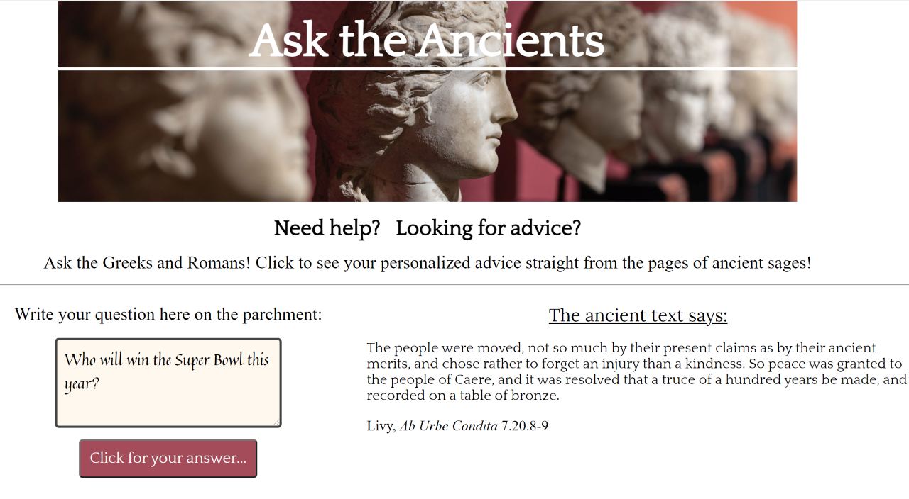

# Quote Generator - Ancient Greek & Roman Edition!  :book:
This web app is a quote generator moonlighting as a silly ancient advice oracle. Type your pressing question into the box, and be amazed (or not!) at the highly relevant (randomly generated) answer delivered to you straight from the pages of ancient sages!  :smile: 

My main inspiration for this approach came from the ancient practice of **bibliomancy** - randomly opening a Bible (or any culturally important book), pointing to a random passage on the page, and then trying to interpret those words as relevant to whatever problem one has at that moment.  
Try it for yourself - and have fun! 

## Current Features
The project started out as just a simple quote generator project, but I soon thought of ways to leverage my Classics background to make the project more fun and landed on the idea of setting up something like a modern Delphic oracle. Ask a question, and get a confusing answer. What does it mean? In the end, it's up to you! (Just remember, the oracle is *always* right!) To keep the classical theme, I experimented with manuscript-ish fonts color palette, particularly in trying to give the input box the vague appearance of parchment. I also enjoyed practicing JavaScript objects as my main data structure. I don't know why, but JS objects are just kinda rad. Maybe it's all those colons.  
Also, this is my first project in which I incorporated **responsive mobile-friendly design** right from the beginning, and I'm proud of how it turned out.

## Skills in Focus
This project gave me the opportunity to practice various front-end skills across HTML, CSS, and JavaScript, including:
- responsive design / media queries
- DOM manipulation
- event listeners
- CSS stylings (especially for the buttons)
- hover states
- floats
- fun with Google fonts

## Roadmap
After a good deal of work, I feel satisfied with the app the way it is. I could have used flex display to achieve the left-right layout, but I intentionally wanted to stick with floats just to force myself to get better at them. The main area for enhancement is just to keep adding more excerpts from Greek and Latin texts. If you read this and have any suggestions for feature additions and/or ancient texts to include, please let me know!

## Acknowledgements :raised_hands:
The original inspiration for this learning project is Miguel Nunez's ["15 Beginner JavaScript Projects"](dev.to/codefoxx/15-beginner-javascript-projects-to-improve-your-front-end-skills-5bcj). Check out this link for other great project ideas.  
I also want to acknowledge my wife and son because they're awesome.

Never stop learning! Never stop coding!
